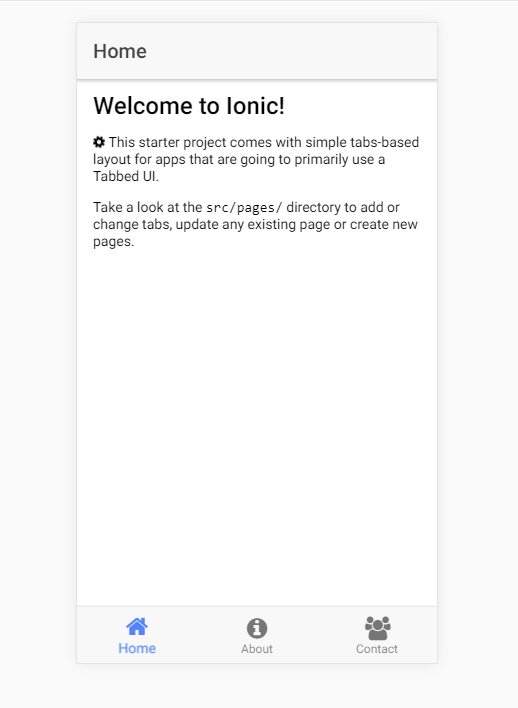

Example Ionic app which uses FontAwesome icons

1) Uses the ionic starter template `tabs`
2) Uses FontAwesome 4.7.0; Ionic 3.9.2
3) Added a simple spinning cog on the Home screen
4) Tab icons are using custom icons, which extend FontAwesome icons. Property is set in tabs.html as `tabIcon="custom-home"`


To get started:
1) `npm i`
2) Copy `node_modules/font-awesome/fonts` folder and paste it under `src/assets`
3) Copy `node_modules/font-awesome/scss` folder and paste it under `src/theme`

`src` folder structure:

```
src
  |
  assets
       |
       fonts
  |
  theme
      |
      scss

```
4) define your custom icons in `variables.scss`


